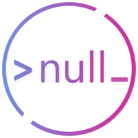
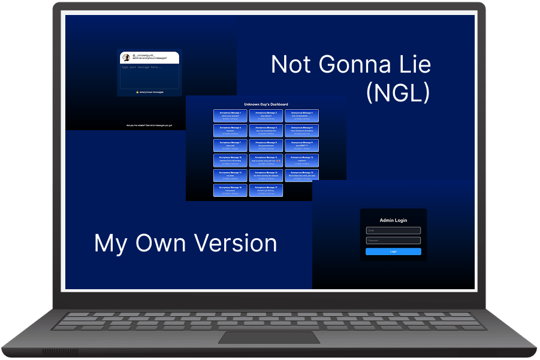

  

  
  
  

 

  

 

<table align="center" border="0">
  <tr border="0">
    <td width="50%" align="center">
      
    </td>
    <td width="50%" align="center">
      
    </td>
  </tr>
</table>

 

  <h2>
    
    Technical Expertise
  </h2>

  <table>
    <tr>
      <td align="center" width="96">
        
         Java
      </td>
      <td align="center" width="96">
        
         Python
      </td>
      <td align="center" width="96">
        
         JavaScript
      </td>
      <td align="center" width="96">
        
         C/C++
      </td>
      <td align="center" width="96">
        
         SQL
      </td>
      <td align="center" width="96">
        
         GitHub
      </td>
    </tr>
    <tr>
      <td align="center" width="96">
        
         HTML
      </td>
      <td align="center" width="96">
        
         CSS
      </td>
      <td align="center" width="96">
        
         Git
      </td>
      <td align="center" width="96">
        
         Figma
      </td>
      <td align="center" width="96">
        
         Vercel
      </td>
      <td align="center" width="96">
        
         VSCode
      </td>
    </tr>
    <tr>
      <td align="center" width="96">
        
         Next.JS
      </td>
      <td align="center" width="96">
        
         Firebase
      </td>
      <td align="center" width="96">
        
         TypeScript
      </td>
      <td align="center" width="96">
        
         React.JS
      </td>
      <td align="center" width="96">
        
         Node.JS
      </td>
      <td align="center" width="96">
        
         Tailwind
      </td>
    </tr>
  </table>

 

  <h2>
    
    Professional Journey
  </h2>

  

    <table border="0">
      <tr>
        <td width="50%" align="right">
          <h3 style="margin-bottom:10px">CSI Chapter VIT-AP</h3>
          
<em>Development Team Member</em>

          
Oct 2024 - Present

        </td>
        <td width="15%" align="center">
          
        </td>
        <td width="40%" align="left">
          <ul>
            <li>Collaborated on user-friendly software solutions</li>
            <li>Conducted code reviews and documentation</li>
            <li>Implemented best practices in development</li>
          </ul>
        </td>
      </tr>
      <tr>
        <td width="50%" align="right">
          <h3 style="margin-bottom:10px">ACM Student Chapter VIT-AP</h3>
          
<em>Project and Research Team Lead</em>

          
Sept 2025 - Present

        </td>
        <td width="15%" align="center">
          
        </td>
        <td width="40%" align="left">
          <ul>
            <li>Coordinated project planning and delivery</li>
            <li>Mentored team members in technical projects and research</li>
            <li>Presented project outcomes at chapter events</li>         
          </ul>
        </td>
      </tr>
      <tr>
        <td width="50%" align="right">
          <h3 style="margin-bottom:10px">Null Chapter VIT-AP</h3>
          
<em>Technical Team Member</em>

          
Aug 2025 - Present

        </td>
        <td width="15%" align="center">
          
        </td>
        <td width="40%" align="left">
          <ul>
            <li>Assisted in developing cybersecurity solutions</li>
            <li>Contributed to building CTF challenges</li>
            <li>Supported technical workshops on events</li>         
          </ul>
        </td>
      </tr>
      <tr>
        <td width="50%" align="right">
          <h3 style="margin-bottom:10px">Open Source Community VIT-AP</h3>
          
<em>Technical Team Member</em>

          
Oct 2024 - Aug 2025

        </td>
        <td width="15%" align="center">
          
        </td>
        <td width="40%" align="left">
          <ul>
            <li>Contributed to open source projects</li>
            <li>Reviewed and improved code for community-driven repositories</li>
            <li>Supported technical workshops</li>         </ul>
        </td>
      </tr>
      <tr>
        <td width="50%" align="right">
          <h3 style="margin-bottom:10px">Microsoft Student Chapter VIT-AP</h3>
          
<em>Outreach Team Member</em>

          
Mar 2024 - May 2025

        </td>
        <td width="15%" align="center">
          
        </td>
        <td width="40%" align="left">
          <ul>
            <li>Connected with industry experts for webinars</li>
            <li>Arranged knowledge-sharing sessions</li>
            <li>Built professional network with industry leaders</li>
          </ul>
        </td>
      </tr>
    </table>
  

 

  <h2>
    
    Signature Projects
  </h2>

  <table border="0" cellspacing="0" cellpadding="0">
    <tr>
      <td width="50%">
        

          <h3>Restaurant Management System</h3>
          
          
A comprehensive system for restaurant operations management with table booking, order processing, and customer feedback features.

          

            
            
            
          

          

            

              
Key Features

              <ul>
                <li>Real-time table reservation system</li>
                <li>Inventory management with automatic alerts</li>
                <li>Customer feedback analysis with sentiment tracking</li>
                <li>Staff scheduling and performance metrics</li>
              </ul>
            

          

        

      </td>
      <td width="50%">
        

            <h3>Exo-Verse: Exploring Exoplanets</h3>
            
            
A platform designed to engage users in exoplanet exploration, offering an interactive interface to learn about planets beyond our solar system.

            

            
            
            
            

            

            

                
Key Features

                <ul>
                <li>Interactive exoplanet exploration interface</li>
                <li>Educational content on planetary features and significance</li>
                <li>Engaging visuals and user-friendly design</li>
                <li>Developed as part of a NASA Hackathon project</li>
                </ul>
            

            

        

      </td>
    </tr>
    <tr>
      <td width="50%">
        

            <h3>Unoccupied Room Finder</h3>
            
            
A web application designed to assist students in locating available classrooms across different blocks and floors, providing real-time data based on specified time slots.

            

            
            
            
            
            
            

            

            

                
Key Features

                <ul>
                <li>Real-time data on unoccupied rooms</li>
                <li>User-friendly interface for selecting day and time slots</li>
                <li>Coverage across multiple university blocks and floors</li>
                <li>Efficient room management for students and faculty</li>
                </ul>
            

            

        

      </td>
      <td width="50%">
        

            <h3>NGL Clone</h3>
            
            
A personalized clone of the NGL anonymous messaging platform, allowing me to receive anonymous messages. Features a basic admin interface for message viewing.

            

            
            
            
            
            

            

            

                
Key Features

                <ul>
                <li>Anonymous message submission via unique links</li>
                <li>Simple admin interface for viewing messages</li>
                <li>Deployed on Vercel for easy access</li>
                </ul>
            

            

        

      </td>
    </tr>
  </table>

  <h3>
    <a href="https://dibyadyuti.vercel.app" style="color: #DD6387; text-decoration: none; font-style: italic;">
      View All Projects →
    </a>
  </h3>

 

  <h2>
    
    Academic Foundation
  </h2>

  <table border="0">
    <tr>
      <td width="40%" align="center">
        
      </td>
      <td width="60%" align="left">
        <h3>Vellore Institute of Technology, AP</h3>
        
<strong>Bachelor of Technology in Computer Science</strong>

        
2023 - Present

        
Focusing on advanced algorithms, web technologies, and cybersecurity principles

      </td>
    </tr>
    <tr>
      <td width="40%" align="center">
        
      </td>
      <td width="60%" align="left">
        <h3>Adamas International School</h3>
        
<strong>Computer Science Student</strong>

        
2009 - 2023

        
Built strong foundations in programming logic and computer science fundamentals

      </td>
    </tr>
  </table>

 

  <h2>
    
    Professional Certifications
  </h2>

        
        
        
         
        
        
        
         
        

 

  <h2>
    
    GitHub Analytics
  </h2>

  

  

 

  

 

  

  

